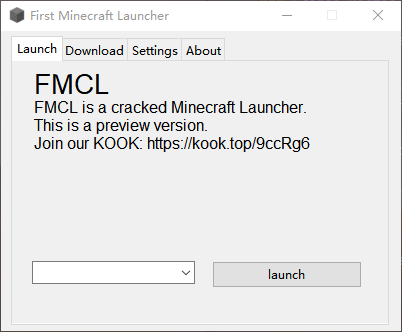

# MeekLauncher
Fork de [here.](https://github.com/Sharll-large/First-Minecraft-Launcher)

#### A Propos
Un launcher Minecraft Java Edition fait en python 

#### Support de platformes
Windows, Linux (bientôt), MacOs

#### But du Fork

- Rendre le launcher plus beau, graphiquement
- Ajoutez plusiers fonctionnalité comme la connection microsoft, changement de skin...
- Le rendre + user-friendly
- Et plein d'autres choses
